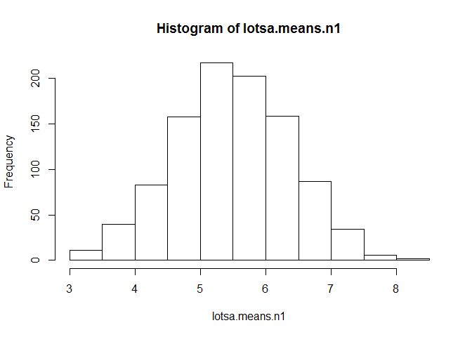
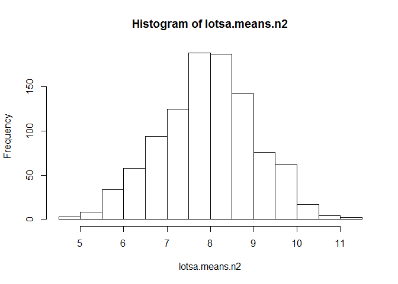
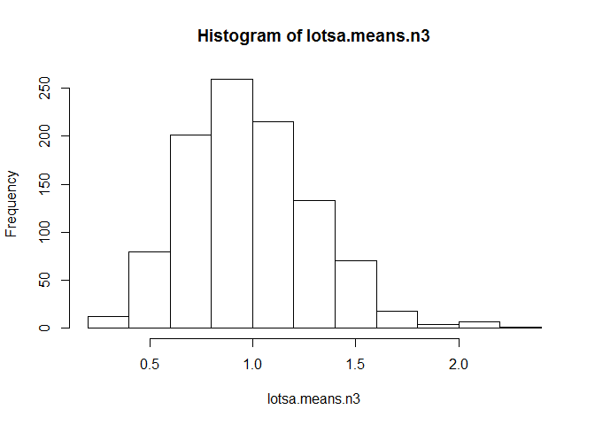
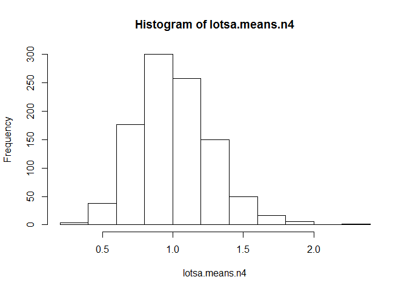

# ADharwadkar_HW4
Abhishek Dharwadkar  
October 23, 2016  

# Random sample with simple sampling
## n is the size of each simulation and nsim is the number of simulations

```r
n1 <- 10
n2 <- 15
nsim <- 1000
```

## initializing the lotsa.means variable

```r
lotsa.means.n1 <- numeric(nsim)
lotsa.means.n2 <- numeric(nsim)
```

## Execute the simulation nsim number of times

```r
lotsa.means.n1 <- replicate(nsim, mean(sample(n1, 10, replace = TRUE)))
lotsa.means.n2 <- replicate(nsim, mean(sample(n2, 15, replace = TRUE)))
```

## plot the histogram for the lotsa.means variables
## The plot is normal distribution

```r
hist(lotsa.means.n1)
```

<!-- -->

```r
hist(lotsa.means.n2)
```

<!-- -->

# Random sample with exponential distribution
## n is the size of each simulation and nsim is the number of simulations

```r
n3 <- 10
n4 <- 15
nsim <- 1000
```

## initializing the lotsa.means variable

```r
lotsa.means.n3 <- numeric(nsim)
lotsa.means.n4 <- numeric(nsim)
```

## Execute the simulation nsim number of times

```r
lotsa.means.n3 <- replicate(nsim, mean(rexp(n3)))
lotsa.means.n4 <- replicate(nsim, mean(rexp(n4)))
```

## plot the histogram for the lotsa.means variables
## The plot is normal distribution

```r
hist(lotsa.means.n3)
```

<!-- -->

```r
hist(lotsa.means.n4)
```

<!-- -->
